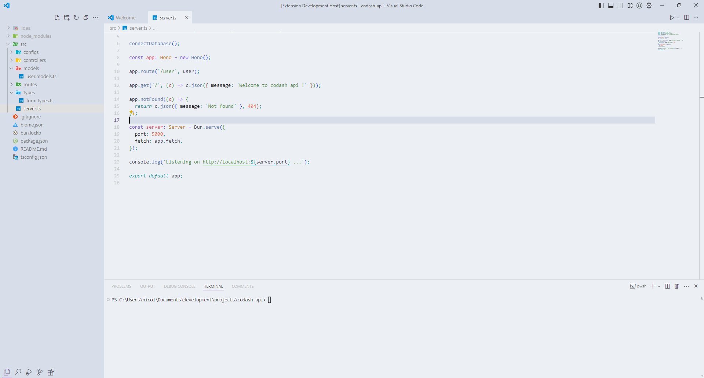

<h3 align="center">

<samp>&gt; Hello, I am
<b><a target="_blank" href="https://seekode.dev/">Nicolas Texier | seekode</a></b>
</samp>

  
 
 
 
 
</h3>

## Theme
I couldn't find a theme that suited me perfectly, so I created this theme which brings together, in my opinion, the best of each theme that I appreciated, in addition of my personal touch.

**Enjoy!**

# About me

Je suis un développeur indépendant passionné par le code depuis 2015. J'ai acquis
une solide expertise dans plusieurs langages de programmation, et j'ai développé une
passion pour la création d'applications, site web, logiciel, et autres programmes en tous
genres.

Depuis 2020 j'ai également développer un interet particulier pour
l'activité de formateur que je prend beaucoup de plaisir ä exercer.

Les Technologies que je maîtrise le plus :

 
 
 
